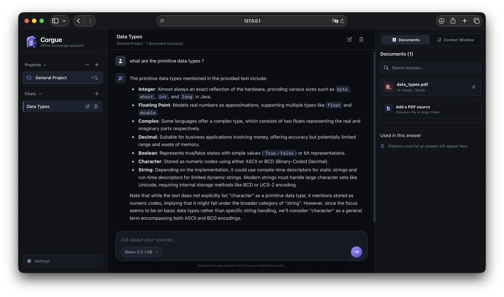

# Corgue


[](LICENSE)

Corgue is a local retrieval-augmented generation (RAG) application built with Python, FastAPI, vanilla HTML/CSS/JavaScript, Microsoft Foundry Local, SQLite, and PDF documents. It extracts and chunks PDFs, generates local embeddings, retrieves relevant chunks with cosine similarity, and streams source-grounded answers from a local chat model.

The application and its data remain on the local machine. FastAPI serves the browser interface on `127.0.0.1`; no hosted service is required.

## Application preview



## How the RAG pipeline works

1. `app/ingest.py` reads a user-selected PDF with `pypdf` and splits the extracted text into overlapping character-based chunks.
2. The chunks are stored in a local SQLite database (`rag.db`).
3. `app/embed_chunks.py` uses the Foundry Local `qwen3-embedding-0.6b` model to generate an embedding for each chunk. Embeddings are serialized as JSON in SQLite.
4. `app/retrieve.py`, `app/rag_chat.py`, and `app/rag_cli.py` embed a question and rank stored chunks using cosine similarity calculated with NumPy.
5. Results below the current `0.35` similarity threshold are rejected so unrelated questions are not sent to the chat model with irrelevant context.
6. The RAG scripts place the best matching accepted chunk in the prompt for the Foundry Local `qwen2.5-1.5b` chat model, which streams an answer to the terminal.

The current retrieval implementation loads all embedded chunks into memory and performs a linear similarity scan. It is suitable for a small local corpus, not a large production index.

## Models and local storage

- **Embedding model:** `qwen3-embedding-0.6b`
- **Chat model:** `qwen2.5-1.5b`
- **Chat smoke-test model:** `qwen2.5-0.5b` in the root `app.py`
- **Database:** SQLite (`rag.db`)

The scripts initialize `FoundryLocalManager`, prepare execution providers, and download/load the required model on first use. Foundry Local manages downloaded model/runtime artifacts separately from the application source. Repository rules also exclude common local model and cache artifacts if they are created inside the project.

## Requirements

- Python 3.11 or newer
- A platform supported by Microsoft Foundry Local
- Enough local storage and memory for the selected models

The original development environment used Python 3.11. The pinned `foundry-local-sdk` and NumPy versions in `requirements.txt` require Python 3.11 or newer.

## Installation

From the repository root:

```bash
python3.11 -m venv .venv
source .venv/bin/activate
python -m pip install --upgrade pip
python -m pip install -r requirements.txt
```

On Windows, activate the environment with:

```powershell
.venv\Scripts\Activate.ps1
```

Run all commands below from the repository root because the current scripts use relative paths for the PDF and database.

## Add a source document

PDF source material is intentionally not tracked. Keep PDFs that you own or have permission to use anywhere outside the repository, then pass the selected file to the ingestion command.

You can provide its path directly:

```bash
python app/ingest.py "/path/to/your/document.pdf"
```

Or run the command without an argument and paste the PDF path when prompted:

```bash
python app/ingest.py
```

```text
Enter the PDF path: /path/to/your/document.pdf
```

Do not publish private, copyrighted, or course material without permission. The empty `data/documents/` directory remains only as an optional local workspace placeholder.

## Ingest PDFs into collection

```bash
python app/ingest.py "/path/to/your/document.pdf"
```

This creates `rag.db` (if it does not exist) and adds chunks from the selected PDF into the `documents` and `chunks` tables. Existing documents are preserved, allowing a multi-document collection. Duplicate PDF indexing is prevented via SHA-256 file hashing.

You can also list or manage documents via CLI:

```bash
python app/ingest.py --list               # List all indexed documents in the collection
python app/ingest.py --delete <DOC_ID>    # Delete a document and its chunks from the collection
python app/ingest.py --clear              # Reset the entire database
```

Optional inspection scripts show extracted text or example chunks without writing to the database:

```bash
python app/read_pdf.py "/path/to/your/document.pdf"
python app/chunk_pdf.py "/path/to/your/document.pdf"
```

## Generate embeddings

After ingestion, generate and store embeddings for chunks that do not already have one:

```bash
python app/embed_chunks.py
```

The first run may take longer while Foundry Local prepares its execution providers and downloads the embedding model.

## Run retrieval

Run the retrieval demonstration with its current built-in query:

```bash
python app/retrieve.py
```

It prints up to three chunks with the highest cosine-similarity scores that also meet the relevance threshold. The query is currently defined in `app/retrieve.py`.

## Run a single RAG question

Run the end-to-end RAG demonstration with its built-in question:

```bash
python app/rag_chat.py
```

This retrieves one chunk, builds a context-only prompt, and streams the local chat model's response.

## Run the interactive RAG CLI

```bash
python app/rag_cli.py
```

Enter questions at the `Question:` prompt. Enter `exit`, `quit`, or `q` to unload the models and stop the program.

## Run the local web interface

Start the local browser interface from the repository root:

```bash
python run_local_rag.py
```

Then open [http://127.0.0.1:7860](http://127.0.0.1:7860). The interface lets you:

- organize documents and chats into separate projects;
- upload one or more PDFs from your computer;
- extract, chunk, embed, and store documents in SQLite;
- ask free-form questions and receive streamed Markdown answers;
- inspect retrieved sources, similarity scores, and context usage;
- download and switch between compatible Foundry Local chat models;
- manage the persistent system prompt from Settings;
- switch the interface between English and Turkish. English is the default, and the choice is remembered on the device.

Model inference and application storage remain local. The first model setup may require an internet connection to download runtime and model artifacts.

## Additional diagnostic scripts

- `app.py` verifies basic streaming chat completion with a small Foundry Local model and a fixed example prompt.
- `app/test_embedding.py` verifies embedding generation and prints embedding metadata.
- `app/inspect_foundry.py` prints selected Foundry Local manager, catalog, and model methods for SDK exploration.

These scripts are retained because they are useful during development, but they are diagnostics rather than automated tests.

## Project structure

```text
local-rag-assistant/
├── app.py                         # Foundry Local chat smoke test
├── app/
│   ├── chunk_pdf.py               # PDF chunking diagnostic
│   ├── embed_chunks.py            # Generate and store chunk embeddings
│   ├── web_app.py                  # FastAPI API and local web server
│   ├── static/                     # Vanilla HTML, CSS, and JavaScript interface
│   ├── ingest.py                  # Extract, chunk, and store the selected PDF
│   ├── inspect_foundry.py         # Foundry Local SDK inspection utility
│   ├── pdf_utils.py               # PDF selection, extraction, and chunking helpers
│   ├── rag_chat.py                # Single-question end-to-end RAG demo
│   ├── rag_cli.py                 # Interactive RAG command-line application
│   ├── read_pdf.py                # PDF extraction diagnostic
│   ├── retrieve.py                # Cosine-similarity retrieval demo
│   └── test_embedding.py          # Embedding smoke test
├── data/
│   └── documents/
│       └── .gitkeep               # Placeholder; local PDFs are ignored
├── .gitignore
├── LOCAL_RAG_SYSTEM_ANALYSIS.md     # Detailed architecture and implementation notes
├── README.md
├── run_local_rag.py                # Starts the local browser application
└── requirements.txt
```

Generated and machine-local files such as `.venv/`, `rag.db`, PDFs, Python caches, secrets, and model caches are excluded from version control.

## Tests

Run the automated settings and localization tests from the repository root:

```bash
python -m unittest discover -s tests -v
```

## Current status and limitations

- Corgue is designed for small and medium-sized local document collections.
- Model aliases, chunk size, overlap, retrieval threshold, and retrieval count are currently code-level constants.
- Chunking uses character boundaries and may split sentences or page markers.
- Embeddings are stored as JSON text in SQLite, and retrieval performs an in-memory linear scan.
- The active web flow retrieves up to four chunks for normal questions and up to eight chunks for recognized overview requests.
- Conversation history uses a sliding window of the latest six messages.
- There is no dedicated vector database, OCR pipeline, user authentication, or citation-content validation.
- A specialized vector database and semantic chunking strategy would be more suitable for substantially larger collections.

## License

This project is licensed under the MIT License. See the [LICENSE](LICENSE) file for details.
